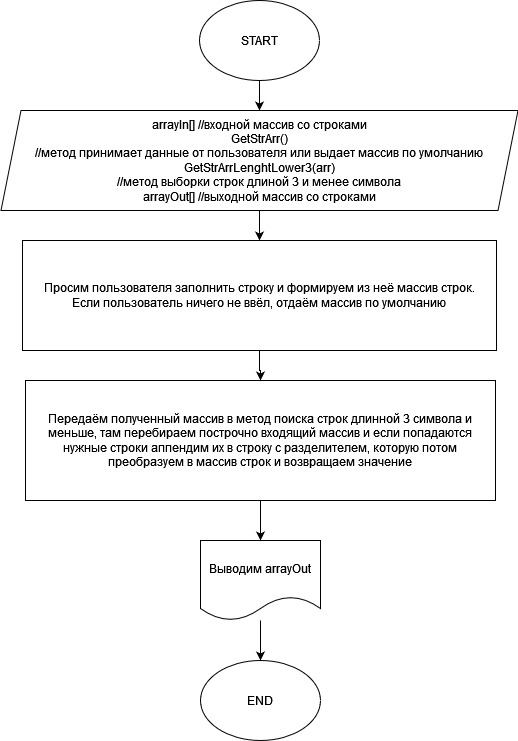

# Справка по работе
Задание расположено по адресу:
[ссыль на задание](https://gbcdn.mrgcdn.ru/uploads/asset/4312773/attachment/ed8c1f2c15da325114976e1c313ef5f8.png "скрин задания")

*В кратце:*
1. Создать репозиторий на Github
2. Нарисовать блок-схему алгоритма - файл [algorithm.jpg](algorithm.jpg "ссылка на картинку с блок-схемой")
3. Создать и заполнить README.md
4. Написать программу [код программы](Program.cs "ссылка на код программы")
5. Использовать контроль версий и коммитить изменения.

**Задача**: Написать программу, которая из массив строк сформирует новый массив со строками, длина которых 3 или менее символа.
Первый массив можно вводить с клавиатуры или задать на старте.
***
Решение: пишем программму согласно блок-схеме алгоритма в файле [algorithm.jpg](algorithm.jpg "ссылка на картинку с блок-схемой")

[Код программы](Program.cs "ссылка на код программы")
